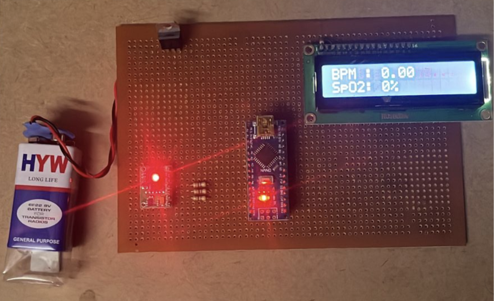

# 🫀 Oxygen & Heart Rate Measurement System

> **Real-time health monitoring system** using MAX30102 sensor for accurate SpO2 and heart rate measurement with Arduino Nano and LCD display.

[](https://www.arduino.cc/)
[](https://isocpp.org/)
[](#)
[](#)
[](#)

## 📋 Project Overview

This hardware-based health monitoring system provides **real-time measurement** of vital signs including:
- **🫁 Oxygen Saturation (SpO2)** - Blood oxygen levels percentage
- **💓 Heart Rate (BPM)** - Beats per minute monitoring
- **📺 LCD Display** - Real-time data visualization
- **🔬 Medical Grade Accuracy** - Suitable for healthcare applications

## ✨ Features

### 🎯 **Core Functionality**
- **📊 Real-time Monitoring** - Continuous SpO2 and heart rate measurement
- **🔍 High Precision** - Medical-grade MAX30102 sensor accuracy
- **📱 LCD Display** - 16x2 character display for immediate readings
- **🔔 Beat Detection** - Audio/visual feedback for heartbeat detection
- **⚡ Low Power** - Efficient power consumption design
- **🔧 Easy Setup** - Plug-and-play hardware configuration

### 🏥 **Medical Applications**
- **Emergency Care** - Quick vital signs assessment
- **Home Monitoring** - Personal health tracking
- **Fitness Tracking** - Exercise and recovery monitoring
- **Research Projects** - Data collection for health studies
- **Educational Use** - Learning embedded systems and sensors

## 🛠️ Hardware Components

| Component | Specification | Purpose |
|-----------|---------------|---------|
|  | ATmega328P, 5V | Main microcontroller |
|  | SpO2 & Heart Rate | Pulse oximetry sensor |
|  | HD44780 Compatible | Data display |
|  | Pull-up resistors | I2C communication |
|  | Half-size recommended | Circuit prototyping |
|  | Male-to-male | Connections |

## 🔌 Circuit Diagram & Connections




### **MAX30102 Sensor to Arduino Nano**
```
MAX30102    Arduino Nano
--------    ------------
VCC      -> 3.3V
GND      -> GND
SDA      -> A4 (SDA)
SCL      -> A5 (SCL)
INT      -> D2 (Optional)
```

### **LCD Display to Arduino Nano**
```
LCD Pin     Arduino Nano
-------     ------------
VSS      -> GND
VDD      -> 5V
V0       -> GND (through 220Ω resistor)
RS       -> D12
Enable   -> D11
D4       -> D5
D5       -> D4
D6       -> D3
D7       -> D2
A        -> 5V
K        -> GND
```

### **Pull-up Resistors**
- **4.7kΩ resistor** between SDA and 3.3V
- **4.7kΩ resistor** between SCL and 3.3V

## 📁 Project Structure

```
Oxygen-Level-Heart-Level-Measurement-System/
├── 📖 README.md                    # Project documentation
├── 📁 code/                        # Source code directory
│   └── 🔧 code.ino                # Main Arduino sketch
├── 📁 circuit/                     # Circuit diagrams (add these)
│   ├── 🔌 schematic.png           # Circuit schematic
│   └── 📷 breadboard.jpg          # Physical setup photo
├── 📁 documentation/               # Additional docs (add these)
│   ├── 📊 datasheet_MAX30102.pdf  # Sensor datasheet
│   └── 📝 user_manual.pdf         # User guide
└── 📁 images/                      # Project images (add these)
    ├── 🖼️ setup.jpg               # Complete setup
    └── 📺 lcd_display.jpg         # LCD showing readings
```

## 🚀 Getting Started

### Prerequisites
- **Arduino IDE** (1.8.0 or later)
- **MAX30100 Library** by OxuanLab
- **LiquidCrystal Library** (built-in)
- **Wire Library** (built-in)

### Installation & Setup

1. **Clone the repository**
   ```bash
   git clone https://github.com/yourusername/Oxygen-Level-Heart-Level-Measurement-System.git
   cd Oxygen-Level-Heart-Level-Measurement-System
   ```

2. **Install required libraries**
   - Open Arduino IDE
   - Go to **Tools > Manage Libraries**
   - Search and install: `MAX30100lib by OxuanLab`

3. **Hardware setup**
   - Connect components according to circuit diagram
   - Double-check all connections
   - Ensure proper power supply (5V for Arduino, 3.3V for sensor)

4. **Upload code**
   - Open `code/code.ino` in Arduino IDE
   - Select **Arduino Nano** as board
   - Choose correct COM port
   - Click **Upload**

5. **Testing**
   - Place finger on MAX30102 sensor
   - Wait for initialization (3 seconds)
   - Observe readings on LCD display
   - Check Serial Monitor for debugging

## 💻 Code Overview

### **Key Functions**
```cpp
void setup() {
    // Initialize serial communication, LCD, and sensor
    // Configure sensor settings and callbacks
}

void loop() {
    // Continuously update sensor readings
    // Display data on LCD every second
    // Handle beat detection events
}

void onBeatDetected() {
    // Callback function for heartbeat detection
    // Provides real-time beat feedback
}
```

### **Core Features**
- **Sensor Initialization** - MAX30102 setup and configuration
- **Real-time Updates** - Continuous sensor polling
- **LCD Display Management** - Formatted output display
- **Beat Detection** - Heartbeat event handling
- **Error Handling** - Sensor failure detection

## 📊 Technical Specifications

### **Measurement Accuracy**
- **SpO2 Range**: 70% - 100%
- **SpO2 Accuracy**: ±2%
- **Heart Rate Range**: 50 - 200 BPM
- **Heart Rate Accuracy**: ±3 BPM
- **Response Time**: < 4 seconds
- **Update Rate**: 1 Hz (1 second intervals)

### **Operating Conditions**
- **Supply Voltage**: 5V (Arduino), 3.3V (Sensor)
- **Operating Temperature**: 0°C to 50°C
- **Storage Temperature**: -20°C to 70°C
- **Humidity**: 15% to 85% RH (non-condensing)

## 🔧 Troubleshooting

### **Common Issues**

| Problem | Possible Cause | Solution |
|---------|----------------|----------|
| "FAILED" on initialization | Wrong wiring or power | Check connections and voltage |
| No readings displayed | Finger not properly placed | Ensure good contact with sensor |
| Erratic readings | Poor finger contact | Clean sensor, press firmly |
| LCD not working | Incorrect pin connections | Verify LCD wiring |
| No beat detection | Weak signal | Adjust finger position |

### **Debug Steps**
1. **Check Serial Monitor** - View debug messages
2. **Verify Connections** - Use multimeter to test continuity
3. **Test Components** - Individually test LCD and sensor
4. **Power Supply** - Ensure stable voltage supply
5. **Library Versions** - Update to latest library versions

## 📈 Future Enhancements

### **Planned Features**
- 📡 **Wireless Connectivity** - Bluetooth/WiFi data transmission
- 💾 **Data Logging** - SD card storage for historical data
- 📱 **Mobile App** - Smartphone companion application
- 🔔 **Alert System** - Configurable health alerts
- 📊 **Web Dashboard** - Real-time web monitoring
- 🔋 **Battery Power** - Portable operation capability

### **Advanced Features**
- **Multi-user Support** - Profile-based measurements
- **Trend Analysis** - Health pattern recognition
- **Cloud Integration** - Remote monitoring capabilities
- **AI Integration** - Predictive health analytics

## 🏥 Medical Disclaimer

⚠️ **Important Notice**: This device is for **educational and research purposes only**. It should not be used for medical diagnosis or treatment decisions. Always consult healthcare professionals for medical advice.

## 🤝 Contributing

We welcome contributions! Please follow these guidelines:

### **How to Contribute**
1. **Fork** the repository
2. **Create** a feature branch (`git checkout -b feature/amazing-feature`)
3. **Commit** your changes (`git commit -m 'Add amazing feature'`)
4. **Push** to the branch (`git push origin feature/amazing-feature`)
5. **Open** a Pull Request

### **Contribution Areas**
- 🐛 Bug fixes and improvements
- 📖 Documentation enhancements
- ✨ New features and functionality
- 🧪 Testing and validation
- 🎨 UI/UX improvements

## 📚 References & Resources

- 📖 **MAX30102 Datasheet**: [Maxim Integrated Documentation](https://datasheets.maximintegrated.com/en/ds/MAX30102.pdf)
- 🔧 **Arduino Documentation**: [Arduino Official Docs](https://docs.arduino.cc/)
- 📚 **Pulse Oximetry Principles**: [Medical references]
- 🛠️ **Embedded Systems**: [Learning resources]

## 📄 License

This project is licensed under the MIT License - see the [LICENSE](LICENSE) file for details.

## 👨‍💻 Author

**Shahbaz Khan**
- 🌐 **Portfolio**: [https://shahbaz1911.netlify.app/](https://shahbaz1911.netlify.app/)
- 📧 **Email**: shahbazkhan19111@gmail.com
- 💼 **LinkedIn**: [linkedin.com/in/yourprofile](https://linkedin.com/in/yourprofile)
- 🐙 **GitHub**: [github.com/yourusername](https://github.com/Shahbaz1911)

## 🙏 Acknowledgments

- **Maxim Integrated** for the MAX30102 sensor
- **Arduino Community** for excellent documentation
- **Open Source Libraries** that made this project possible
- **Medical Device Standards** for accuracy guidelines

## 📞 Support

- 🐛 **Issues**: [GitHub Issues](https://github.com/yourusername/Oxygen-Level-Heart-Level-Measurement-System/issues)
- 💬 **Discussions**: [GitHub Discussions](https://github.com/yourusername/Oxygen-Level-Heart-Level-Measurement-System/discussions)
- 📧 **Email**: project.support@example.com

---

<div align="center">
  <p>⭐ Star this repository if it helped you!</p>
  <p>Built with ❤️ for health monitoring and embedded systems learning</p>
  <p>
    <a href="#-oxygen--heart-rate-measurement-system">Back to Top</a>
  </p>
</div>
